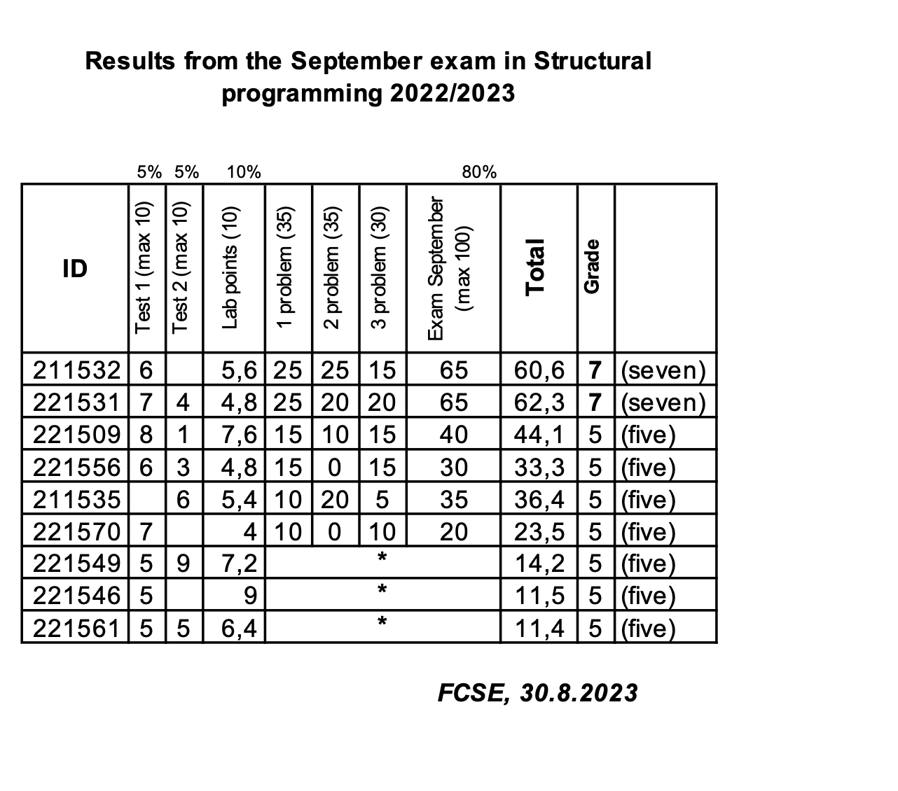

# Аудиториска вежба 1

## Ова е првата аудиториска вежба по СП

### Задача 1

Aj da vidime slikata dali ke se pokaze na HTML-to




здраво шо?
```cpp
#include<iostream>
using namespace std;

int main (){
    return 0;
}
```

### Задача 2

```cpp
#include<iostream>
using namespace std;

int main (){
    count<<"Hello world"<<endl;
    return 0;
}
```
